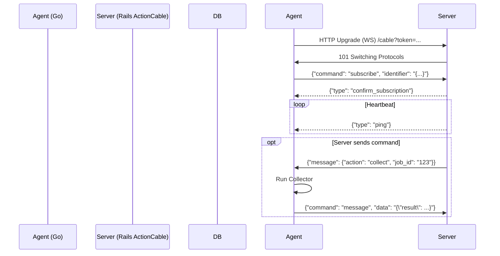

# **FEATURE REQUEST: Bidirectional Communication via WebSocket**

**Status**: Draft  
**Priority**: High  
**Target Version**: v0.6.0  
**Related**: `AGENT.md`, `WEB.md`

## **1. Context & Problem Statement**

目前系統依賴「半雙向」通訊機制：

1. **Agent -> Server**: 透過 HTTP POST (`/api/v1/inventory/push`) 主動回報。
2. **Server -> Agent**: 透過 SSH 遠端執行 (`SshExecutionService`) 下達指令。

此架構存在以下痛點：

* **NAT/防火牆限制**: Server 若要主動連線 Agent，需依賴複雜的 Jump Host 設定或要求 Agent 擁有 Public IP。
* **即時性不足**: SSH 建立連線成本高（Handshake），無法頻繁且快速地進行狀態確認。
* **憑證管理風險**: Server 需持有 Agent 的 SSH Key，增加資安管理負擔。

## **2. Goals**

建立基於 **WebSocket (Rails ActionCable)** 的雙向通訊機制，達成：

1. **Firewall Friendly**: 僅需 Agent 對外連線 (Outbound 443)，無需開啟 Inbound Ports。
2. **Real-time Control**: Server 可毫秒級下達指令（如立即觸發 Inventory Collect 或 Benchmark）。
3. **Presence Monitoring**: Server 可即時感知 Agent 是否在線 (Online/Offline)。

## **3. Proposed Architecture**

### **3.1 High-Level Design**



### **3.2 Server-Side Specs (Rails)**

* **Technology**: ActionCable (Standard Rails).
* **Authentication**:
* 使用 URL Query Parameter 或 Header 傳遞 `Agent Token`。
* 驗證失敗則拒絕連線 (`reject_unauthorized_connection`)。

* **Channel**: `AgentChannel`
* **Scope**: 每個 Node 訂閱專屬的 Stream (e.g., `node_123_channel`).
* **Events**:
* `subscribed`: 標記 Node 狀態為 `online`，更新 `last_seen_at`。
* `unsubscribed`: 標記 Node 狀態為 `offline`。
* `receive(data)`: 處理 Agent 回傳的指令執行結果。

### **3.3 Agent-Side Specs (Go)**

Agent 需實作 ActionCable Client Protocol。

* **Mode**: 新增 `hpc-agent start` (Daemon Mode)。
* **Library**: 建議使用 `nhooyr.io/websocket` 或 `github.com/gorilla/websocket`。
* **Protocol Details**:
* **Handshake**: 連線至 `wss://<server>/cable`。
* **Subscription**: 發送 JSON:

```json
{
  "command": "subscribe",
  "identifier": "{\"channel\":\"AgentChannel\"}"
}

```

* **Heartbeat**: 忽略 `type: ping` 訊息，但需偵測若過久未收到 ping 則視為斷線並重連。
* **Message Handling**: 解析 `message` 欄位中的 Payload (e.g., `{"action": "run_benchmark"}`) 並呼叫對應 Service。

## **4. Implementation Plan**

### **Phase 1: Agent Daemon & WS Client (Go)**

1. [Agent] 實作 `cmd/start.go`，建立長駐 Process。
2. [Agent] 實作 `core/stream/client.go`，封裝 WebSocket 連線與 ActionCable 協議 (Subscribe/Ping)。
3. [Agent] 實作自動重連機制 (Exponential Backoff)。

### **Phase 2: Server Channel & Auth (Rails)**

1. [Server] 建立 `app/channels/agent_channel.rb`。
2. [Server] 實作 Connection Authentication (驗證 `X-Node-ID` 或 Token)。
3. [Server] 實作 `PresenceService` 更新 Node 在線狀態。

### **Phase 3: Command Dispatching**

1. [Server] 修改 `TriggerCollectService`：

* 檢查 Node 是否 `online`。
* 若是：透過 ActionCable Broadcast 指令。
* 若否：Fallback 至 SSH (Legacy support)。

1. [Agent] 接收 WS 指令並串接既有的 `collector` 模組。

## **5. API Schema (WebSocket Payload)**

**Server -> Agent (Command):**

```json
{
  "identifier": "{\"channel\":\"AgentChannel\"}",
  "message": {
    "type": "command",
    "action": "collect_inventory",
    "params": {
      "force": true
    },
    "correlation_id": "uuid-1234"
  }
}

```

**Agent -> Server (Response):**

```json
{
  "command": "message",
  "identifier": "{\"channel\":\"AgentChannel\"}",
  "data": "{\"action\":\"report_result\", \"correlation_id\":\"uuid-1234\", \"status\":\"success\", \"payload\": {...}}"
}

```

## **6. Security Considerations**

* **TLS Only**: 僅允許 `wss://` 連線。
* **Token Rotation**: Agent Token 應可被輪替，舊連線在 Token 失效後應被 Server 強制斷線。
