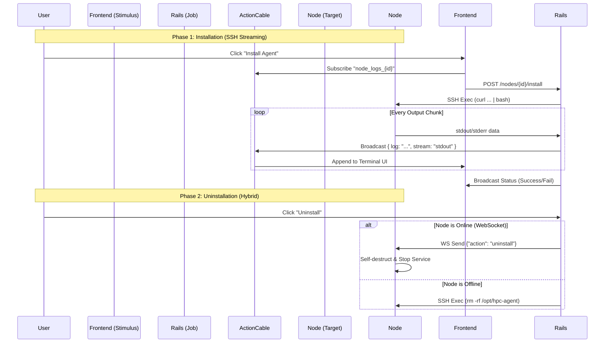

# **FEATURE REQUEST: Live Installation Logs & Hybrid Uninstall**

**Status**: Draft  
**Priority**: Medium  
**Target Version**: v0.7.0  
**Dependencies**: `ActionCable` (configured), `Stimulus`

## **1. Context & Problem Statement**

目前的 Agent 安裝與移除機制存在以下問題：

1. **黑箱作業 (Black Box Installation)**: 使用者點擊「安裝」後，後端透過 SSH 執行，前端僅能等待 Job 完成。若過程卡住（如下載慢或權限詢問），使用者無法得知進度。
2. **移除機制單一 (Fragile Uninstallation)**: 僅依賴 SSH 進行移除。若 Agent 位於 NAT 後且 SSH Port 關閉（但在線），Server 無法透過 WebSocket 下達移除指令，導致「殭屍節點」無法被清除。
3. **缺乏除錯資訊**: 安裝失敗時，使用者通常只收到 generic error，缺乏 stderr 的詳細資訊。

## **2. Goals**

1. **Real-time Feedback**: 安裝過程中，將 SSH 的 `stdout` 與 `stderr` 即時串流至前端介面（模擬 Terminal 體驗）。
2. **Reliable Uninstallation**: 採用「混合策略 (Hybrid Strategy)」，優先使用 WebSocket (Graceful) 移除，失敗時才退回 SSH (Force)。
3. **Transparent UX**: 讓使用者能看見完整的 Shell 執行過程，增加對系統的信任感。

## **3. Architecture Design**

### **3.1 Sequence Diagram**

## **4. Technical Specifications**

### **4.1 Backend: SSH Service Upgrade**

* **File**: `app/services/ssh_execution_service.rb`
* **Change**: 修改 `execute_ssh_command` 方法，增加 `block` 支援，允許呼叫端處理即時輸出。
* **Logic**:
* 使用 `Net::SSH` 的 `on_data` (stdout) 與 `on_extended_data` (stderr) callback。
* 將捕捉到的 chunk 即時 `yield` 給 caller。

### **4.2 Backend: Installation Streaming**

* **File**: `app/services/agent/remote_install_service.rb`
* **Change**:
* 在呼叫 SSH service 時傳入 block。
* 在 block 內呼叫 `ActionCable.server.broadcast("node_logs_#{node.id}", payload)`。
* Payload 格式：`{ status: "running", log: "...", stream: "stdout|stderr" }`。

### **4.3 Backend: Hybrid Uninstallation**

* **File**: `app/services/agent/remote_uninstall_service.rb`
* **Logic**:

1. 檢查 `node.online?` (基於 WebSocket 連線狀態)。
2. **若在線**: 透過 `AgentChannel` 發送 `{ action: "uninstall" }` 指令。
3. **若離線**: 維持原有的 SSH 移除邏輯 (`sudo systemctl stop ...`)，但同樣加上 Log Streaming 以便除錯。

### **4.4 Frontend: Terminal UI**

* **File**: `app/javascript/controllers/log_stream_controller.js`
* **Responsibility**:
* 建立 ActionCable subscription (`NodeLogChannel`).
* 接收 Log 資料並動態 Append 到 DOM。
* 處理 ANSI color codes (Optional) 或簡單區分 stderr (紅色) / stdout (灰色)。
* 自動捲動到底部 (Auto-scroll)。

### **4.5 ActionCable Channel**

* **File**: `app/channels/node_log_channel.rb`
* **Auth**: 確保只有具備該 Node 權限的使用者可以訂閱日誌頻道。

## **5. Implementation Steps**

### **Step 1: Backend Core (SSH Streaming)**

* [ ] Refactor `SshExecutionService` to support streaming blocks.
* [ ] Update `RemoteInstallService` to broadcast logs via ActionCable.
* [ ] Create `NodeLogChannel` class.

### **Step 2: Frontend (Live Terminal)**

* [ ] Create `log_stream_controller.js`.
* [ ] Update `app/views/nodes/installs/new.html.erb`:
* [ ] Add a container `
`.
* [ ] Add a scrollable `<pre>` area for logs.

### **Step 3: Hybrid Uninstall Logic**

* [ ] Update `RemoteUninstallService` to check `node.online?`.
* [ ] Implement WebSocket "uninstall" command dispatching (server-side).
* [ ] (Requires Agent Update) Ensure Agent handles "uninstall" command (stops service, removes binary).

## **6. Security Considerations**

* **Sensitive Data**: 安裝 Script 中若包含 `AGENT_TOKEN`，應避免在 Log 中回傳，或者在廣播前進行 `gsub` 遮蔽處理。
* **Access Control**: ActionCable channel 必須驗證 `current_user` 對該 Node 的存取權限 (`Pundit` check)。
