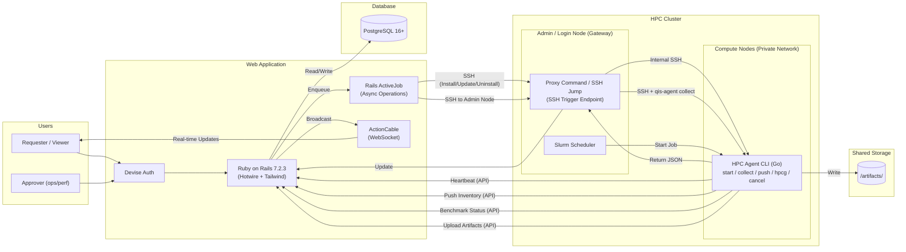

# **HPC System Detection & Benchmark Tool**

Version: 0.9.0
Status: Active Development
Last Updated: 2026-01-20
Changes: Full agent lifecycle management (install/update/uninstall with rollback), multi-architecture binary support, ActionCable real-time communication, Devise authentication, and expanded CLI commands.

## **1. 背景與目標 (Background & Objectives)**

在 HPC Linux 叢集中（x86_64 + aarch64），提供一套工具能達成以下目標：

* **全觀可視化**：以 Web UI 檢視各節點系統資訊（CPU/Memory/Storage/OS+Kernel/Network/IP…）。  
* **節點管理**：以 Web UI 管理節點清單（匯入 CSV）並手動觸發資訊更新。  
* **效能評測**：以 Web UI 檢視 Benchmark Recipes，並透過 CLI/Agent 原生編譯並執行 **HPCG**。  
* **數據追溯**：將評測結果 (Metrics) 與產出檔案 (Artifacts) 上傳至中央系統與共享儲存，確保可追溯性。

## **2. 使用者與角色 (User Roles)**

* **Requester (一般使用者)**：  
  * **V1**: 可檢視節點狀態、直接建立並執行 Benchmark Run Request (無須審核)。  
  * **V2**: 建立 Request 需經過 Approver 審核流程。  
* **Approver (Ops/Perf Team)** (**V2 新增**)：  
  * 可核准 Request（核准後才能提交 Slurm Job），管理節點清單。  
* **Viewer (唯讀)**：僅能檢視 Dashboard 與報告。

## **3. 環境與約束 (Environment & Constraints)**

* **HPC Environment**: Linux-based, Heterogeneous Architecture (x86_64 + aarch64).  
* **Network Topology**:  
  * **Web Server**: 位於管理網段 (Management Network) 或外部網路。  
  * **Compute Nodes**: 位於私有網段 (Private Network)，無法由 Web Server 直接連線。  
  * **Admin/Login Node**: 雙網卡 (Dual-homed)，作為 **Bastion Host (跳板機)** 或 **Gateway**，Web Server 需透過此節點管理 Compute Nodes。  
* **Storage**: Shared Storage (NFS/Lustre/GPFS) mounted on all nodes, **writable** by users/agent.  
* **Scheduler**: Slurm (V1 採用 Slurm Job 觸發 srun/sbatch).  
* **Modules**: Lmod / Environment Modules.

### **3.1 技術選型 (Tech Stack Decisions)**

* **Agent**: **Go (Golang) 1.22+**
  * 使用 **Cobra** 構建 CLI。
  * 優勢：編譯為 Static Binary，無須在各節點安裝 Runtime，部署極簡。
* **Web Framework**: **Ruby on Rails 7.2.3**
  * 架構：Server-Side Rendering (Monolith)。
  * Testing: **RSpec** (Unit, Request, System specs).
  * Background Jobs: **Rails ActiveJob** with default async adapter.
  * Real-time: **ActionCable** for WebSocket communication (benchmark status updates, heartbeat notifications).
  * Authentication: **Devise** for user authentication with role-based access control.
* **Frontend Interaction**: **Hotwire** (Turbo Drive, Turbo Frames, Turbo Streams) + Stimulus.js.
  * 透過 HTML Over The Wire 達成類 SPA 體驗，同時保持開發單純性。
* **Styling**: **Tailwind CSS**.
* **Database**: **PostgreSQL 16+**.
* **Design System**: NetBox-inspired (Data-dense, slate headers, bold uppercase titles, square corners).

### 3.2 Hardware Inventory & Telemetry

* **Core Info**: CPU (Model, Cores), RAM (DIMM details, Topology), Disk, Network.
* **Advanced Telemetry (New)**: Integration with **Intel PerfSpect** for architectural profiling.
* **Collection Strategy**:
  * **Primary**: PerfSpect (requires external binary).
  * **Fallback**: standard `dmidecode` / `lshw`.
* **Deployment Flow**:
  * The web server prepares the correct PerfSpect binary for the target server architecture.
  * The web server pushes the matching binary to the target server and installs it in the same folder as the `qis-agent` binary.
* **Versioning**: Parsers are strictly bound to specific PerfSpect release versions to ensure data integrity.

## **4. 核心決策 (Core Decisions)**

* **執行模型**: **Hybrid (Push & Pull)**  
  * **Inventory (Pull via Gateway)**: Server 端 Collector 建立 SSH 連線至 **Admin Node**，再由 Admin Node 透過內部網路 (SSH/PDSH/Slurm) 觸發 Compute Node 的 `qis-agent collect`。  
  * **Inventory (Push)**: Agent 可透過 cron 或啟動腳本執行 `qis-agent inventory push` 主動回報 (適用於自動註冊/定期更新，需確保 Compute Node 可訪問 Web API)。  
  * **Benchmark (Push)**: Slurm Job 內的 Agent 主動執行並回報 DB，Artifacts 直寫 Shared Storage。  
* **Nodes 來源**: **Web UI 匯入 (CSV)** + 靜態清單 + Agent 主動註冊。  
* **Benchmark 環境**: **Native Compilation** (on-the-fly compile using modules/toolchain).
* **Auth**:  
  * **V1 (Standard)**:  
    * **Agent**: Cluster scoped API Token.  
    * **Web UI**: Local Web User Auth (Database-backed sessions).  
  * **V2 (Enterprise)**:  
    * **Web UI**: LDAP/AD Integration.
* **資料保留**: Node Current State + Historical Snapshots (Versioning).
* **規模**: < 50 Nodes, 20-200 Runs/day.

## **5. 功能需求 (Functional Requirements - V1)**

### **5.1 Inventory Management**

* **Node 匯入 (Web UI)**:  
  * 支援上傳 CSV 檔案。  
  * CSV 格式：hostname, ip (選填), role (compute/login), arch (選填)。  
  * 後端解析並更新 nodes 資料表。  
* **主動收集 (Agent Push)**:
  * Command: `qis-agent inventory push`。
  * 行為：Agent 收集本機資訊 -> POST 到 API Server -> 更新 DB。
* **被動觸發 (Server Pull via Admin Node)**:
  * Action: Web UI 點擊 "Collect Now" (單一節點或批次)。
  * Backend Flow:
        1. Rails (Sidekiq) 建立 SSH 連線至 **Admin Node**。
        2. 在 Admin Node 上執行遠端指令 (e.g., `ssh <compute_node> qis-agent collect --json` 或 `pdsh`)。
        3. 取得 JSON 輸出並解析更新 DB。  
* **配置版本控制 (Configuration Versioning)**:  
  * 系統需保留節點的歷史狀態 (History)。  
  * 每次收集 (Push/Pull) 若偵測到硬體或系統資訊變更（如 Kernel 更新、記憶體增減），應建立新的 node_state 版本記錄，而非僅覆蓋舊資料。  
* **硬體資訊 V2 (Enhanced Hardware Info)**:
  * **System & BIOS**: 包含 Manufacturer, Product Name, Serial Number, UUID, BIOS Version/Date.
  * **CPU Detail**: 包含 Architecture, Model, Sockets, NUMA Topology (Node ID to CPU mapping), 以及關鍵指令集 (AVX/AMX/SSE) 高亮顯示。
  * **Memory Topology**: 視覺化記憶體插槽佈局，依據 Socket 與 Channel 進行階層式分組，顯示 DIMM 狀態 (Active/Empty/Downgraded) 與詳細資訊 (Size, Speed, Serial)。
* **資料欄位**:  
  * System (DMI system info)
  * BIOS (DMI bios info)
  * Host (Hostname, Arch, OS, Kernel)  
  * CPU (Model, Cores, Threads, NUMA, Flags)  
  * Memory (Total, Free, Visual Topology Map)  
  * Storage (Disk usage, Mountpoints)  
  * Network (Interfaces, IP, MAC)

### **5.2 Agent Lifecycle Management**

Complete agent lifecycle management with install, update, uninstall, and compilation services.

#### **5.2.1 InstallService**
* **Multi-Architecture Support**: Automatically selects correct binary (x86_64, aarch64) based on node architecture.
* **SSH Deployment**: Connects via bastion (global or custom) or direct SSH based on node configuration.
* **Systemd Integration**: Deploys agent as a systemd service with auto-start.
* **UUID Assignment**: Generates and writes unique node UUID to `/etc/qis-agent/node_id`.
* **SELinux Configuration**: Sets appropriate contexts (`bin_t`, `systemd_unit_file_t`).
* **Checksum Verification**: Verifies binary integrity before and after deployment.
* **dmidecode Setup**: Configures SUID for dmidecode to allow hardware inventory collection.

#### **5.2.2 UpdateService**
* **Version Upgrade**: Upgrades agent to newer release versions.
* **Rollback Support**: Backs up existing binary for automatic rollback on failure.
* **Health Verification**: Verifies service health after update via systemd status check.
* **Busy Node Prevention**: Blocks updates when node has running benchmarks.

#### **5.2.3 UninstallService**
* **SSH-based Removal**: Removes agent binary, service file, and configuration.
* **Service Cleanup**: Stops and disables systemd service before removal.
* **Configuration Removal**: Cleans up `/etc/qis-agent/` directory.

#### **5.2.4 CompilerService**
* **Source Compilation**: Builds agent from Go source code.
* **Cross-Compilation**: Supports building for different architectures (GOOS/GOARCH).
* **Version Tagging**: Embeds version information via ldflags.

#### **5.2.5 AgentEvent (Audit Trail)**
* **Operation Tracking**: Records install, upgrade, and uninstall operations.
* **Status Lifecycle**: pending -> running -> success/failed/rolled_back.
* **Error Capture**: Stores error messages and detailed error information as JSON.
* **Duration Tracking**: Records started_at and completed_at timestamps.
* **User Attribution**: Links operations to the user who initiated them.

### **5.3 Benchmarks Repository**

* UI 顯示 Released Recipes：  
  * **HPCG (High Performance Conjugate Gradients)**  
* 資訊包含：Version, Profiles (Module stack, Flags, Parameters), Supported Arch.

### **5.4 Benchmark Runs**

* **Execution Flow**: Web UI triggers Agent -> Agent executes benchmark -> Results uploaded via API.
* **Status Lifecycle**: `pending` -> `running` -> `success` / `failed` / `cancelled`
* **Real-time Updates**: Turbo Streams broadcast status changes to connected clients.
* **Agent 職責 (Go Binary)**:
  1. **Environment Setup**: Load Modules, Check Fingerprint.
  2. **Build**: Compile xhpcg (Native).
  3. **Config**: 自動生成 hpcg.dat。
  4. **Run**: 執行 srun ./xhpcg。
  5. **Parse**: 解析 Log 取得 GFLOPS, Time, Residual, Pass/Fail。
  6. **Upload**: 更新 DB 狀態 (API)，上傳 Artifact Index。
* **Cancellation Flow**:
  * User clicks Cancel in Web UI -> POST to `/benchmark_runs/:id/cancel`.
  * Agent polls cancellation status and terminates running process.
  * Status updated to `cancelled` with timestamp.
* **Artifact Upload**:
  * Artifacts uploaded as base64-encoded content via API.
  * Stored using ActiveStorage with path tracking in `artifact_indices`.
  * Supports download via `/benchmark_runs/:id/artifacts/:artifact_id/download`.

### **5.5 Artifacts Management**

* **儲存位置**：預設位於專案資料夾下的 /artifacts/<cluster_id>/<run_id>/，可透過 config.yaml 設定覆寫路徑（通常指向 Shared Storage）。  
* **寫入機制**：原子性寫入 (Atomic Write)。先寫入 <run_id>.tmp/，完成後 Rename 為 <run_id>/。  
* **必要檔案**：MANIFEST.json, run-meta.json, Logs, Raw Results.

### **5.6 Web UI Features (Rails + Hotwire)**

整合 NetBox 設計規範，採用單體式架構 (Monolith) 實作。

#### **5.6.1 全域導航與佈局 (Global Layout)**

* **Sidebar Navigation**:  
  * **位置**: 固定左側 (Fixed Left, 240px~280px)。  
  * **風格**: NetBox Slate (深色背景, 品牌綠色強調)。  
  * **選單項目**:  
    * Dashboard, Nodes, Benchmark Runs, Recipes, API Keys, Settings.
* **UI Components**:
  * **card-netbox**: 標準化卡片元件，包含 slate 背景標題列 (card-header) 與粗體大寫標題。
  * **Modals**: 統一使用 `shared/_modal` 模板，支援 Turbo Frame 非同步載入。

#### **5.6.2 總覽儀表板 (Overview Dashboard)**

* **關鍵指標 (Hero Metrics Cards)**:  
  * 採用 `card-netbox` 樣式，依據指標類型提供顏色強調 (Emerald/Violet/Blue/Amber)。
* **節點熱圖 (Visual Node Grid)**:  
  * **呈現**: 小方塊網格，支援狀態顏色標示。  
  * **互動**: 點擊節點開啟「過濾模式」，下方列表即時更新。  
  * **Tooltip**: 高 z-index 懸浮提示，顯示節點詳細狀態。
* **近期活動 (Filtered Runs List)**:  
  * 列出最新執行的評測，包含狀態圖示、Recipe 名稱、節點名稱與耗時。

#### **5.6.3 詳細檢測面板 (Run Detail Inspector)**

* **元件**: **Slide-over Panel**。  
* **內容結構**:  
  * **Tabs**: Summary (基本資訊), Metrics (詳細數值), Logs (執行日誌), Artifacts (產出檔案清單)。

#### **5.6.4 Nodes & Runs Pages**

* **Nodes Page**:  
  * 提供節點清單管理，支援單一或批次資訊收集。
* **Node Detail View**:  
  * **功能**: 分頁檢視節點資訊 (Overview, Hardware, History, Logs)。
  * **Hardware Tab**: 展示 V2 硬體資訊，包含 System/BIOS 表格與互動式 **Memory Topology Map**。
  * **History**: 支援切換不同時間點的硬體快照。

### **5.7 Agent CLI Commands (Go)**

| Command | Description |
|---------|-------------|
| `qis-agent start` | Daemon mode: runs as systemd service, sends periodic heartbeats to server, handles benchmark execution requests |
| `qis-agent collect` | Output system info JSON to stdout (CPU, Memory, Disk, Network, DMI) |
| `qis-agent push` | Collect inventory and POST to server API (`/api/v1/inventory/push`) |
| `qis-agent hpcg` | Execute HPCG benchmark workflow (build, configure, run, parse, upload) |
| `qis-agent cancel` | Cancel a running benchmark by UUID |
| `qis-agent check-key` | Validate API key against server |

* **Daemon Mode** (`start`):
  * Sends heartbeats every 30 seconds to `/api/v1/nodes/:id/heartbeat`.
  * Reads configuration from environment variables: `HPC_SERVER_URL`, `HPC_API_TOKEN`, `HPC_NODE_UUID`.
  * Node UUID stored in `/etc/qis-agent/node_id`.
* **Non-Goals (Future)**: Build Cache, Multi-node orchestration (Rank0 leader), HPL support.
* **Deploy**: 單一靜態編譯執行檔 (Single Static Binary).

## **6. 資料模型 (Data Schema)**

### **6.1 Core Models**

* **nodes**: Node inventory and configuration
  * id, hostname (unique), ip, role (compute/login/admin), arch (x86_64/aarch64/arm64), source (manual/csv/agent_push)
  * uuid: Unique identifier for agent registration
  * ssh_port, ssh_user, ssh_password, ssh_key, ssh_connect_method (global_bastion/custom_bastion/direct)
  * jump_host, jump_user, jump_port: Custom bastion configuration
  * agent_path, agent_version, agent_status, api_token, api_key_id
  * last_seen_at, last_heartbeat_at, benchmark_work_dir

* **node_states**: **(Versioned Data)**
  * id: PK, node_id: FK
  * cpu_info, mem_info, disk_info, net_info, host_info, dmi_info, network_inventory: JSONB system info snapshots
  * captured_at: Version creation timestamp
  * 說明：One Node has_many NodeStates。最新的一筆即為 Current State。

* **benchmark_recipes**: Benchmark definitions
  * id, name (unique with version), version, slug (unique)
  * command, description, default_profile (JSONB)
  * timeout_seconds (default: 3600), status (active/archived)

* **benchmark_runs**: Benchmark execution records
  * id, node_id: FK, benchmark_recipe_id: FK, uuid (unique)
  * started_at, finished_at, status (pending/running/success/failed/cancelled)
  * metrics (JSONB), arguments (JSONB), error_message
  * current_phase, log_content, log_path, last_heartbeat_at

* **artifact_indices**: Benchmark output files
  * id, benchmark_run_id: FK, path, stored_path, file_type, size

### **6.2 Agent Management Models**

* **agent_releases**: Agent version releases
  * id, version (unique, semantic version format)
  * checksum (SHA256), release_notes
  * status (active/deprecated/recalled)

* **agent_binaries**: Architecture-specific binaries (belongs_to agent_release)
  * id, agent_release_id: FK, arch (unique per release)
  * checksum (SHA256)
  * binary: ActiveStorage attachment

* **agent_events**: Audit trail for agent operations
  * id, node_id: FK, user_id: FK (optional), agent_release_id: FK (optional)
  * operation (install/upgrade/uninstall), status (pending/running/success/failed/rolled_back)
  * from_version, to_version, forced
  * error_message, error_details (JSONB)
  * started_at, completed_at

### **6.3 Authentication & Configuration Models**

* **users**: Web UI authentication (Devise)
  * id, email (unique), encrypted_password, name
  * role (viewer/requester/approver), reset_password_token

* **api_keys**: Agent API authentication
  * id, name, token (unique), status (active/revoked), last_used_at

* **ssh_settings**: Global SSH configuration (singleton)
  * id, bastion_host, bastion_user, bastion_port (default: 22)
  * server_url, benchmark_work_dir

## **7. 非功能需求 (Non-Functional Requirements)**

* **Performance**: `qis-agent collect` < 1s.  
* **Reliability**: API Idempotency.  
* **Security**: HTTPS only, Token-based Agent Auth.  
* **UX**: 符合 NetBox 設計規範 (Data-dense)，支援 Dark/Light Mode 自動切換 (Tailwind dark: variant)。  
* **Color System**: 使用 Tailwind 語意化命名 (bg-app, bg-surface, status-success 等) 以支援主題切換。

## **8. 系統架構圖 (System Architecture)**

## **9. 未來增強 (Future Enhancements)**

此段落記錄尚未實作的功能規劃。

> **Note**: The following features from previous backlog have been implemented and integrated into main sections:
> - Host Info Collection & Visualization (Section 5.1)
> - Network Interface & InfiniBand Discovery (Section 5.1)
> - UI Theme Migration / NetBox Style (Section 5.6)
> - Manual Node CRUD & SSH Jump Host Support (Sections 5.1, 5.6)

### **9.1 Intel PerfSpect Integration**

**Status**: Pending
**Priority**: High
**Target Version**: v1.0.x
**Dependencies**: `agent` (Go), `perfspect` (External Binary)

#### **9.1.1 Context & Goal**

為了取得更深層的系統資訊 (Uncore counters, NUMA topology, PCIe bandwidth)，整合 Intel PerfSpect。若 PerfSpect 失敗，回落到 `dmidecode`。

#### **9.1.2 Integration Strategy (Untracked Approach)**

* 不將 PerfSpect 原始碼納入 Git
* Web Server 依架構準備對應 binary 並推送到目標主機
* 安裝位置：與 `qis-agent` 同層目錄

#### **9.1.3 Version Binding & Parser Logic**

* Parser 需綁定特定版本
* Target Version: Release v3.x.x (specify concrete version, e.g., v3.12.1)
* 啟動或收集時執行 `./perfspect version`
* 若版本不符，視為不可用並 fallback
* Version-specific structs in `agent/core/parser/perfspect/v3_x_x/`
* 嚴格解碼 JSON，缺欄位即錯誤

#### **9.1.4 Execution Flow & Fallback**

The Agent should implement a `HybridInventoryCollector`.

1. Attempt PerfSpect:
   * `sudo ./perfspect report --format json --output /tmp/report.json`
   * Timeout: 120 seconds
   * Success criteria: exit code 0 and JSON file exists and is non-empty
2. Parse & Transform JSON -> `HostInventory`
3. Fallback to `dmidecode -t 0,1,17` on failure
4. UI 顯示資料來源：PerfSpect (green) / Legacy DMI (yellow)

#### **9.1.5 UI Requirements (Node Show Page)**

* Advanced Telemetry section (PerfSpect only)
* Hardware Topology (Socket/Core/Thread map)
* PCIe Bandwidth (Negotiated width/speed)
* PMU/Uncore counters summary
* Source Indicator: `Data Source: Intel PerfSpect vX.Y`

#### **9.1.6 Action Items**

1. Build per-architecture PerfSpect binaries
2. Push binaries to target servers
3. Install alongside `qis-agent`
4. Implement `PerfspectCollector`
5. Implement `FallbackCollector`

### **9.2 Agent WebSocket Mode**

**Status**: Pending
**Priority**: Medium
**Target Version**: v1.1.x

#### **9.2.1 Context**

Replace HTTP polling with bidirectional WebSocket communication via ActionCable for real-time agent control.

#### **9.2.2 Features**

* Agent connects to ActionCable endpoint on startup
* Server can push commands to agent (run benchmark, cancel, collect inventory)
* Real-time log streaming during benchmark execution
* Immediate status updates without polling

#### **9.2.3 Technical Considerations**

* Fallback to HTTP polling when WebSocket unavailable
* Connection reconnection with exponential backoff
* Authentication via API token in connection params

### **9.3 HPL Benchmark Support**

**Status**: Pending
**Priority**: Medium
**Target Version**: v1.1.x

#### **9.3.1 Context**

Add support for High-Performance Linpack (HPL) benchmark alongside HPCG.

#### **9.3.2 Features**

* HPL benchmark recipe with configurable parameters (N, NB, P, Q)
* Auto-detection of optimal problem size based on available memory
* Parse HPL.out for GFLOPS result
* Support for OpenMPI and Intel MPI

### **9.4 Multi-Node Orchestration**

**Status**: Pending
**Priority**: Low
**Target Version**: v1.2.x

#### **9.4.1 Context**

Enable distributed benchmarks across multiple nodes using Rank0 leader pattern.

#### **9.4.2 Features**

* Rank0 agent coordinates benchmark across participating nodes
* Aggregate results from all ranks
* Handle node failures gracefully
* Support for MPI-based benchmarks (HPL, HPCG with MPI)

### **9.5 Build Cache**

**Status**: Pending
**Priority**: Low
**Target Version**: v1.2.x

#### **9.5.1 Context**

Cache compiled benchmark binaries to avoid repeated compilation.

#### **9.5.2 Features**

* Hash-based cache key (compiler version, flags, source version)
* Shared cache on shared storage or per-node local cache
* Cache invalidation on module stack changes
* Configurable cache TTL  
