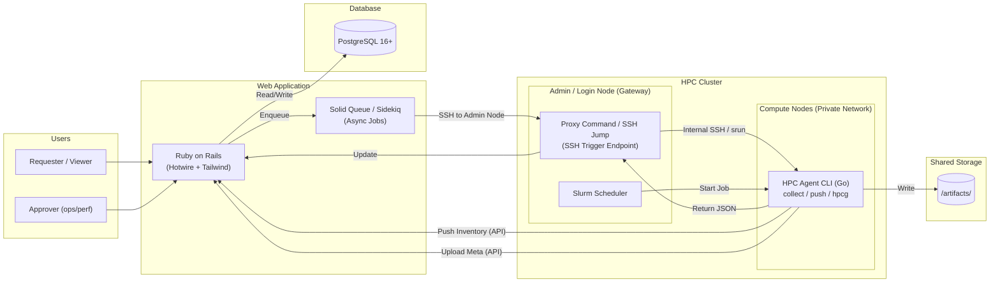

# **HPC System Detection & Benchmark Tool**

Version: 0.7.0  
Status: Active Development  
Last Updated: 2026-01-12  
Changes: Standardized UI with NetBox theme, implemented v2 Host Hardware Info (Memory Topology), and added remote agent management.

## **1. 背景與目標 (Background & Objectives)**

在 HPC Linux 叢集中（x86_64 + aarch64），提供一套工具能達成以下目標：

* **全觀可視化**：以 Web UI 檢視各節點系統資訊（CPU/Memory/Storage/OS+Kernel/Network/IP…）。  
* **節點管理**：以 Web UI 管理節點清單（匯入 CSV）並手動觸發資訊更新。  
* **效能評測**：以 Web UI 檢視 Benchmark Recipes，並透過 CLI/Agent 原生編譯並執行 **HPCG**。  
* **數據追溯**：將評測結果 (Metrics) 與產出檔案 (Artifacts) 上傳至中央系統與共享儲存，確保可追溯性。

## **2. 使用者與角色 (User Roles)**

* **Requester (一般使用者)**：  
  * **V1**: 可檢視節點狀態、直接建立並執行 Benchmark Run Request (無須審核)。  
  * **V2**: 建立 Request 需經過 Approver 審核流程。  
* **Approver (Ops/Perf Team)** (**V2 新增**)：  
  * 可核准 Request（核准後才能提交 Slurm Job），管理節點清單。  
* **Viewer (唯讀)**：僅能檢視 Dashboard 與報告。

## **3. 環境與約束 (Environment & Constraints)**

* **HPC Environment**: Linux-based, Heterogeneous Architecture (x86_64 + aarch64).  
* **Network Topology**:  
  * **Web Server**: 位於管理網段 (Management Network) 或外部網路。  
  * **Compute Nodes**: 位於私有網段 (Private Network)，無法由 Web Server 直接連線。  
  * **Admin/Login Node**: 雙網卡 (Dual-homed)，作為 **Bastion Host (跳板機)** 或 **Gateway**，Web Server 需透過此節點管理 Compute Nodes。  
* **Storage**: Shared Storage (NFS/Lustre/GPFS) mounted on all nodes, **writable** by users/agent.  
* **Scheduler**: Slurm (V1 採用 Slurm Job 觸發 srun/sbatch).  
* **Modules**: Lmod / Environment Modules.

### **3.1 技術選型 (Tech Stack Decisions)**

* **Agent**: **Go (Golang) 1.22+**  
  * 使用 **Cobra** 構建 CLI。  
  * 優勢：編譯為 Static Binary，無須在各節點安裝 Runtime，部署極簡。  
* **Web Framework**: **Ruby on Rails 7.1+**  
  * 架構：Server-Side Rendering (Monolith)。  
  * Testing: **RSpec** (Unit, Request, System specs).
* **Frontend Interaction**: **Hotwire** (Turbo Drive, Turbo Frames, Turbo Streams) + Stimulus.js.  
  * 透過 HTML Over The Wire 達成類 SPA 體驗，同時保持開發單純性。  
* **Styling**: **Tailwind CSS**.
* **Database**: **PostgreSQL 16+**.
* **Design System**: NetBox-inspired (Data-dense, slate headers, bold uppercase titles, square corners).

### 3.2 Hardware Inventory & Telemetry

* **Core Info**: CPU (Model, Cores), RAM (DIMM details, Topology), Disk, Network.
* **Advanced Telemetry (New)**: Integration with **Intel PerfSpect** for architectural profiling.
* **Collection Strategy**:
  * **Primary**: PerfSpect (requires external binary).
  * **Fallback**: standard `dmidecode` / `lshw`.
* **Deployment Flow**:
  * The web server prepares the correct PerfSpect binary for the target server architecture.
  * The web server pushes the matching binary to the target server and installs it in the same folder as the `hpc-agent` binary.
* **Versioning**: Parsers are strictly bound to specific PerfSpect release versions to ensure data integrity.

## **4. 核心決策 (Core Decisions)**

* **執行模型**: **Hybrid (Push & Pull)**  
  * **Inventory (Pull via Gateway)**: Server 端 Collector 建立 SSH 連線至 **Admin Node**，再由 Admin Node 透過內部網路 (SSH/PDSH/Slurm) 觸發 Compute Node 的 `hpc-agent collect`。  
  * **Inventory (Push)**: Agent 可透過 cron 或啟動腳本執行 `hpc-agent inventory push` 主動回報 (適用於自動註冊/定期更新，需確保 Compute Node 可訪問 Web API)。  
  * **Benchmark (Push)**: Slurm Job 內的 Agent 主動執行並回報 DB，Artifacts 直寫 Shared Storage。  
* **Nodes 來源**: **Web UI 匯入 (CSV)** + 靜態清單 + Agent 主動註冊。  
* **Benchmark 環境**: **Native Compilation** (on-the-fly compile using modules/toolchain).
* **Auth**:  
  * **V1 (Standard)**:  
    * **Agent**: Cluster scoped API Token.  
    * **Web UI**: Local Web User Auth (Database-backed sessions).  
  * **V2 (Enterprise)**:  
    * **Web UI**: LDAP/AD Integration.
* **資料保留**: Node Current State + Historical Snapshots (Versioning).
* **規模**: < 50 Nodes, 20-200 Runs/day.

## **5. 功能需求 (Functional Requirements - V1)**

### **5.1 Inventory Management**

* **Node 匯入 (Web UI)**:  
  * 支援上傳 CSV 檔案。  
  * CSV 格式：hostname, ip (選填), role (compute/login), arch (選填)。  
  * 後端解析並更新 nodes 資料表。  
* **主動收集 (Agent Push)**:
  * Command: `hpc-agent inventory push`。
  * 行為：Agent 收集本機資訊 -> POST 到 API Server -> 更新 DB。
* **被動觸發 (Server Pull via Admin Node)**:
  * Action: Web UI 點擊 "Collect Now" (單一節點或批次)。
  * Backend Flow:
        1. Rails (Sidekiq) 建立 SSH 連線至 **Admin Node**。
        2. 在 Admin Node 上執行遠端指令 (e.g., `ssh <compute_node> hpc-agent collect --json` 或 `pdsh`)。
        3. 取得 JSON 輸出並解析更新 DB。  
* **配置版本控制 (Configuration Versioning)**:  
  * 系統需保留節點的歷史狀態 (History)。  
  * 每次收集 (Push/Pull) 若偵測到硬體或系統資訊變更（如 Kernel 更新、記憶體增減），應建立新的 node_state 版本記錄，而非僅覆蓋舊資料。  
* **硬體資訊 V2 (Enhanced Hardware Info)**:
  * **System & BIOS**: 包含 Manufacturer, Product Name, Serial Number, UUID, BIOS Version/Date.
  * **CPU Detail**: 包含 Architecture, Model, Sockets, NUMA Topology (Node ID to CPU mapping), 以及關鍵指令集 (AVX/AMX/SSE) 高亮顯示。
  * **Memory Topology**: 視覺化記憶體插槽佈局，依據 Socket 與 Channel 進行階層式分組，顯示 DIMM 狀態 (Active/Empty/Downgraded) 與詳細資訊 (Size, Speed, Serial)。
* **資料欄位**:  
  * System (DMI system info)
  * BIOS (DMI bios info)
  * Host (Hostname, Arch, OS, Kernel)  
  * CPU (Model, Cores, Threads, NUMA, Flags)  
  * Memory (Total, Free, Visual Topology Map)  
  * Storage (Disk usage, Mountpoints)  
  * Network (Interfaces, IP, MAC)

### **5.2 Agent Lifecycle Management (新增)**

* **遠端安裝 (Remote Install)**:
  * 透過 Web UI 填寫跳板機 (Bastion) 與目標節點資訊（Sudo 密碼）。
  * 自動化流程：連線 -> 上傳 Binary -> 設定服務 -> 啟動並向 API 註冊。
  * 支援選取不同的 API Key。
* **遠端卸載 (Remote Uninstall)**:
  * 一鍵移除節點上的 Agent 服務與相關檔案。
  * 狀態追蹤：即時顯示卸載進度。

### **5.3 Benchmarks Repository**

* UI 顯示 Released Recipes：  
  * **HPCG (High Performance Conjugate Gradients)**  
* 資訊包含：Version, Profiles (Module stack, Flags, Parameters), Supported Arch.

### **5.4 Benchmark Runs (Slurm-first)**

* 流程：使用者提交 Slurm Script -> Job 啟動 Agent -> Agent 執行評測。  
* Agent 職責 (Go Binary)：  
  1. **Environment Setup**: Load Modules, Check Fingerprint.  
  2. **Build**: Compile xhpcg (Native).  
  3. **Config**: 自動生成 hpcg.dat。  
  4. **Run**: 執行 srun ./xhpcg。  
  5. **Parse**: 解析 Log 取得 GFLOPS, Time, Residual, Pass/Fail。  
  6. **Upload**: 更新 DB 狀態 (API)，上傳 Artifact Index。

### **5.5 Artifacts Management**

* **儲存位置**：預設位於專案資料夾下的 /artifacts/<cluster_id>/<run_id>/，可透過 config.yaml 設定覆寫路徑（通常指向 Shared Storage）。  
* **寫入機制**：原子性寫入 (Atomic Write)。先寫入 <run_id>.tmp/，完成後 Rename 為 <run_id>/。  
* **必要檔案**：MANIFEST.json, run-meta.json, Logs, Raw Results.

### **5.6 Web UI Features (Rails + Hotwire)**

整合 NetBox 設計規範，採用單體式架構 (Monolith) 實作。

#### **5.6.1 全域導航與佈局 (Global Layout)**

* **Sidebar Navigation**:  
  * **位置**: 固定左側 (Fixed Left, 240px~280px)。  
  * **風格**: NetBox Slate (深色背景, 品牌綠色強調)。  
  * **選單項目**:  
    * Dashboard, Nodes, Benchmark Runs, Recipes, API Keys, Settings.
* **UI Components**:
  * **card-netbox**: 標準化卡片元件，包含 slate 背景標題列 (card-header) 與粗體大寫標題。
  * **Modals**: 統一使用 `shared/_modal` 模板，支援 Turbo Frame 非同步載入。

#### **5.6.2 總覽儀表板 (Overview Dashboard)**

* **關鍵指標 (Hero Metrics Cards)**:  
  * 採用 `card-netbox` 樣式，依據指標類型提供顏色強調 (Emerald/Violet/Blue/Amber)。
* **節點熱圖 (Visual Node Grid)**:  
  * **呈現**: 小方塊網格，支援狀態顏色標示。  
  * **互動**: 點擊節點開啟「過濾模式」，下方列表即時更新。  
  * **Tooltip**: 高 z-index 懸浮提示，顯示節點詳細狀態。
* **近期活動 (Filtered Runs List)**:  
  * 列出最新執行的評測，包含狀態圖示、Recipe 名稱、節點名稱與耗時。

#### **5.6.3 詳細檢測面板 (Run Detail Inspector)**

* **元件**: **Slide-over Panel**。  
* **內容結構**:  
  * **Tabs**: Summary (基本資訊), Metrics (詳細數值), Logs (執行日誌), Artifacts (產出檔案清單)。

#### **5.6.4 Nodes & Runs Pages**

* **Nodes Page**:  
  * 提供節點清單管理，支援單一或批次資訊收集。
* **Node Detail View**:  
  * **功能**: 分頁檢視節點資訊 (Overview, Hardware, History, Logs)。
  * **Hardware Tab**: 展示 V2 硬體資訊，包含 System/BIOS 表格與互動式 **Memory Topology Map**。
  * **History**: 支援切換不同時間點的硬體快照。

### **5.7 Agent V1 Scope (Go)**

V1 Agent 功能定義：

1. **Collect**:  
   * `hpc-agent collect`: 輸出系統資訊 (CPU/Mem/Disk/Net) JSON 到 stdout。
   * `hpc-agent inventory push`: 收集資訊並主動 POST 至 API。
2. **HPCG Run (Single-node)**: 完整 Build/Run/Parse 流程。

* **Non-Goals**: Build Cache, Multi-node orchestration (Rank0 leader), HPL support.  
* **Deploy**: 單一靜態編譯執行檔 (Single Static Binary)。

## **6. 資料模型 (Data Schema - V1)**

* nodes: id, hostname, ip, role, arch, source (csv/manual/agent_push).  
* node_states: **(Versioned Data)**  
  * id: PK  
  * node_id: FK  
  * cpu_json, mem_json, disk_json, net_json, host_json, dmi_json: 系統資訊快照。  
  * captured_at: 此版本建立時間 (Timestamp)。  
  * 說明：One Node has_many NodeStates。最新的一筆即為 Current State。  
* benchmark_recipes: id, name (hpcg), version, default_profile_json.  
* benchmark_runs: id, node_id, recipe_id, start_time, end_time, status, metrics_json (gflops).  
* artifact_indices: run_id, path, file_type, size.

## **7. 非功能需求 (Non-Functional Requirements)**

* **Performance**: `hpc-agent collect` < 1s.  
* **Reliability**: API Idempotency.  
* **Security**: HTTPS only, Token-based Agent Auth.  
* **UX**: 符合 NetBox 設計規範 (Data-dense)，支援 Dark/Light Mode 自動切換 (Tailwind dark: variant)。  
* **Color System**: 使用 Tailwind 語意化命名 (bg-app, bg-surface, status-success 等) 以支援主題切換。

## **8. 系統架構圖 (System Architecture)**



## **9. 功能需求延伸與需求備忘 (Feature Requests Backlog)**

此段落整合原先散落於 `docs/FEATURE_REQUEST_*.md` 與 `docs/agent/FEATURE_REQUEST_*.md` 的內容，作為單一來源。

### **9.1 Host Info Collection & Visualization (Phased)**

**Status**: Draft  
**Priority**: High  
**Target Version**: v0.6.x (Phase 1), v0.7.x (Phase 2), v0.9.x (Phase 3)

#### **9.1.1 Context & Roadmap**

為了取得詳細的硬體資訊（System, BIOS, Memory DIMM），採用三階段導入策略：

| Phase | Method | Ops Requirement | Pros | Cons |
| :--- | :--- | :--- | :--- | :--- |
| **Phase 1** | **dmidecode + SUID** | `chmod u+s /usr/sbin/dmidecode` | 實作最快，Agent 無需改動 sudo 邏輯 | 安全性較低 (全域使用者皆可讀 DMI) |
| **Phase 2** | **dmidecode + Sudoers** | `/etc/sudoers` NOPASSWD 設定 | 安全性標準，符合資安稽核 | 需維護 Sudoers 規則 |
| **Phase 3** | **Intel PerfSpect** | 安裝 PerfSpect 依賴 | 可取得更深層 PMU/Uncore 數據 | 部署成本較高 |

#### **9.1.2 Data Requirements**

Agent 需透過 `dmidecode -t 0,1,17` 取得並解析以下資訊：

**System Information (Type 1)**

* Manufacturer, Product Name, Version  
* Serial Number, UUID (節點去重識別)  
* SKU Number, Family  

**BIOS Information (Type 0)**

* Vendor, Version, Release Date  
* Address, Runtime Size, ROM Size  

**Memory Information (Type 17)**

* Bank Locator (UI 拓樸分組 Primary Key)  
* Locator, Size, Type  
* Speed, Configured Memory Speed  
* Manufacturer, Part Number, Serial Number  
* Asset Tag, Rank, Voltage, Firmware Version, Form Factor  

#### **9.1.3 UI Requirements (NetBox Style)**

**Page Header & Layout**

* Breadcrumb: `Home / Nodes / [Node Name] / Hardware`  
* Header: Title (節點名稱) + Subtitle (Product Name & Serial Number)  
* Actions: Edit, Delete, Refresh  

**Info Panels (System & BIOS)**

* Two-column cards with key-value tables  
* Header background `bg-slate-100`  
* Zebra rows (`odd:bg-white even:bg-slate-50`)  
* Key column bold, left-aligned  

**Memory Topology Map**

* Container title: "Memory Topology"  
* Hierarchy: `Socket -> Channel (Optional) -> Slot`  
* Socket block header (e.g., "CPU 0") with per-socket grid layout  
* Slot component shape: vertical rectangle  
* DIMM Slot states:
  * Installed: `bg-green-500` with bold white text  
  * Empty: `bg-slate-100` with dashed border  
  * Warning (Config Speed < Spec Speed): yellow badge  
* Slot content layout: Locator (top, small), Size (middle, bold), Type (bottom, tiny)  
* Tooltip: Manufacturer, Part Number, Speed  

**Memory Detailed Table**

* Columns: Slot, Status (Badge), Size, Type, Speed (Config/Spec), Manufacturer, Part Number  
* Compact padding with row hover highlight  

#### **9.1.4 V2 Enhancements (Flexible Grouper)**

* Regex Extraction: 從 `Bank Locator` 或 `Locator` 提取 CPU/Socket/Node 標記  
* Fallback: 若無法解析，顯示為 Default Group  
* Grouping: `Socket Container -> Channel Subgroup -> Slot Item`  
* 保留原始 `Bank Locator` 字串，讓前端擴展解析  
* Parser 必須辨識 "No Module Installed" / "Not Specified" 並回傳 Empty 狀態  
* Reference: Oracle Memory Topology Documentation (visual grouping guidance) - <https://docs.oracle.com/cd/E27124_01/html/E27125/z40006011391452.html>  

#### **9.1.5 Technical Implementation (Agent)**

**Model Update (`agent/core/model/inventory.go`)**

```go
type HostDMIInfo struct {
    System SystemInfo   `json:"system"`
    BIOS   BIOSInfo     `json:"bios"`
    Memory []DIMMInfo   `json:"memory"`
}

type SystemInfo struct {
    Manufacturer string `json:"manufacturer"`
    ProductName  string `json:"product_name"`
    Version      string `json:"version"`
    SerialNumber string `json:"serial_number"`
    UUID         string `json:"uuid"`
    SKU          string `json:"sku_number"`
    Family       string `json:"family"`
}

type BIOSInfo struct {
    Vendor      string `json:"vendor"`
    Version     string `json:"version"`
    ReleaseDate string `json:"release_date"`
    Address     string `json:"address"`
    RuntimeSize string `json:"runtime_size"`
    ROMSize     string `json:"rom_size"`
}

type DIMMInfo struct {
    Locator         string `json:"locator"`
    BankLocator     string `json:"bank_locator"`
    Size            string `json:"size"`
    Type            string `json:"type"`
    Speed           string `json:"speed"`
    ConfiguredSpeed string `json:"configured_speed"`
    Manufacturer    string `json:"manufacturer"`
    PartNumber      string `json:"part_number"`
    SerialNumber    string `json:"serial_number"`
}
```

**Execution Strategy**

1. Check `HPC_DMIDECODE_METHOD` (`direct` vs `sudo`)  
2. Execute `dmidecode -t 0,1,17` in one call  
3. Parse sections (`System Information`, `BIOS Information`, `Memory Device`)  

#### **9.1.6 Operations Guide**

**Phase 1 Setup**

```bash
sudo chmod u+s $(which dmidecode)
```

**Phase 2 Migration**

```bash
sudo chmod u-s $(which dmidecode)
echo "hpc-user ALL=(root) NOPASSWD: /usr/sbin/dmidecode" | sudo tee /etc/sudoers.d/hpc-agent
```

### **9.2 Network Interface & InfiniBand Discovery**

**Status**: Draft  
**Priority**: High  
**Target Version**: v0.7.x  
**Style Guide**: NetBox-inspired (Interface Tables, Status Badges, LAG/Bonding visualization)

#### **9.2.1 Context & Strategy**

採用分層收集策略 (Layered Collection Strategy)：

| Layer | Scope | Source | Purpose |
| --- | --- | --- | --- |
| **L1** | Hardware (PCIe) | `lspci` | 識別卡型號與 NUMA 綁定 |
| **L2** | OS / Logical | `ip`, `/sys/class/net` | IP, MAC, MTU, Link State |
| **L3** | High Performance (IB) | `ibv_devinfo`, `/sys/class/infiniband` | LID, GUID, Link Width/Speed |

#### **9.2.2 Data Requirements**

**L1: Physical Hardware (PCIe)**

* Source: `lspci -vmm -D`
* PCI Address (Primary Key), Vendor, Device, NUMA Node  

**L2: Logical Interfaces (Ethernet & IB)**

* MTU: `ip -j link show`  
* Speed:  
  * Ethernet: `/sys/class/net/<iface>/speed`  
  * InfiniBand: `ibv_devinfo` or `/sys/class/infiniband/<hca>/ports/<port>/rate`  
  * Handle `-1` or missing values for virtual interfaces  
* UI Display: Human readable (e.g., "200 Gbps (HDR)")  

**L3: InfiniBand Specifics**

* HCA Name, Port State, LID, GUID, Link Rate, Link Width  

#### **9.2.3 UI Requirements (NetBox Style)**

**Interfaces Table**

* Columns: Name, Status, Type, IP Address, MAC/GUID, Speed, PCI, Actions  
* Name: bold link, indent child rows for bond members  
* Type: label (e.g., `1000BASE-T`, `InfiniBand HDR`)  
* IP Address: show primary IP, with "+N more" tooltip when multiple  
* MAC/GUID: monospace  
* PCI: show PCI address; clicking filters to matching interfaces  
* Status Badges:
  * Active (UP): `bg-green-500 text-white`
  * Down: `bg-red-500 text-white`
  * Testing/PFC: `bg-yellow-500`  
* Row Actions: "Graph" (traffic) and "Edit"  

**InfiniBand Detail Card**

* Header: `HCA Details: mlx5_0`  
* Fields: LID (hex + decimal), GUID, Firmware (tooltip or extra field), Negotiated Speed vs Supported  
* Warning if Negotiated < Supported  

**LAG / Bonding Visualization**

* Parent row `bond0` (Type: LAG)  
* Child rows `eth0`, `eth1` with slightly darker background  

#### **9.2.4 Technical Implementation (Agent)**

**Dependencies**

* `iproute2`, `pciutils`, `rdma-core` (optional)  
* If `rdma-core` missing, return L1/L2 only (graceful degradation)  

**Model Structure (`agent/core/model/network.go`)**

```go
type NetworkInventory struct {
    Interfaces []InterfaceInfo `json:"interfaces"`
}

type InterfaceInfo struct {
    // L2: Logical (OS)
    Name        string   `json:"name"`
    Type        string   `json:"type"`
    OperState   string   `json:"oper_state"`
    MACAddress  string   `json:"mac_address"`
    MTU         int      `json:"mtu"`
    IPAddresses []string `json:"ip_addresses"`
    Master      string   `json:"master"`

    // L1: Physical (PCI)
    PCIAddress  string   `json:"pci_address,omitempty"`
    Vendor      string   `json:"vendor,omitempty"`
    Model       string   `json:"model,omitempty"`
    NUMANode    int      `json:"numa_node"`

    // L3: InfiniBand
    InfiniBand  *IBInfo  `json:"infiniband,omitempty"`
}

type IBInfo struct {
    HCAName   string `json:"hca_name"`
    Port      int    `json:"port"`
    LID       string `json:"lid"`
    GUID      string `json:"guid"`
    LinkSpeed string `json:"link_speed"`
}
```

**Execution Logic**

1. PCI Discovery: `lspci -vmm` -> map PCI Address to Vendor/Model  
2. Link Discovery: `ip -j link show`  
3. IP Discovery: `ip -j addr show`  
4. IB Enrichment: `/sys/class/infiniband/<hca>/ports/<port>/`  

#### **9.2.5 Operations Guide**

* `ip` and `lspci` usually do not require root  
* For full `/sys` access, use sudo or grant `CAP_NET_ADMIN`  

### **9.3 Intel PerfSpect Integration**

**Status**: Draft  
**Priority**: High  
**Target Version**: v0.9.x  
**Dependencies**: `agent` (Go), `perfspect` (External Binary)

#### **9.3.1 Context & Goal**

為了取得更深層的系統資訊 (Uncore counters, NUMA topology, PCIe bandwidth)，整合 Intel PerfSpect。若 PerfSpect 失敗，回落到 `dmidecode`。

#### **9.3.2 Integration Strategy (Untracked Approach)**

* 不將 PerfSpect 原始碼納入 Git  
* Web Server 依架構準備對應 binary 並推送到目標主機  
* 安裝位置：與 `hpc-agent` 同層目錄  

#### **9.3.3 Version Binding & Parser Logic**

* Parser 需綁定特定版本  
* Target Version: Release v3.x.x (specify concrete version, e.g., v3.12.1)  
* 啟動或收集時執行 `./perfspect version`  
* 若版本不符，視為不可用並 fallback  
* Version-specific structs in `agent/core/parser/perfspect/v3_x_x/`  
* 嚴格解碼 JSON，缺欄位即錯誤  

#### **9.3.4 Execution Flow & Fallback**

The Agent should implement a `HybridInventoryCollector`.

1. Attempt PerfSpect:
   * `sudo ./perfspect report --format json --output /tmp/report.json`
   * Timeout: 120 seconds  
   * Success criteria: exit code 0 and JSON file exists and is non-empty  
2. Parse & Transform JSON -> `HostInventory`  
3. Fallback to `dmidecode -t 0,1,17` on failure  
4. UI 顯示資料來源：PerfSpect (green) / Legacy DMI (yellow)  

#### **9.3.5 UI Requirements (Node Show Page)**

* Advanced Telemetry section (PerfSpect only)  
* Hardware Topology (Socket/Core/Thread map)  
* PCIe Bandwidth (Negotiated width/speed)  
* PMU/Uncore counters summary  
* Source Indicator: `Data Source: Intel PerfSpect vX.Y`  

#### **9.3.6 Action Items**

1. Build per-architecture PerfSpect binaries  
2. Push binaries to target servers  
3. Install alongside `hpc-agent`  
4. Implement `PerfspectCollector`  
5. Implement `FallbackCollector`  

### **9.4 UI Theme Migration (NetBox Style)**

**Objective**: Replace current UI theme with a strict NetBox v4+ visual style while staying on Rails + Tailwind.  
**Constraint**: Do not introduce Bootstrap, Sass, or Tabler CSS; use Tailwind utilities only.  

#### **9.4.1 Design System & Tokens**

**Color Palette (Tailwind Mapping)**

| UI Element | NetBox Context | Tailwind Class | Hex Approximation |
| --- | --- | --- | --- |
| Brand Primary | Buttons, Active Links | `bg-teal-600` / `text-teal-600` | `#0097a7` |
| Sidebar Bg | Left Navigation | `bg-slate-900` | `#242e42` |
| Sidebar Text | Inactive Links | `text-slate-400` | `#9ca3af` |
| Sidebar Hover | Active/Hover Link | `bg-slate-800 text-teal-400` | -- |
| Page Bg | App Background | `bg-slate-100` | `#f1f5f9` |
| Card Bg | Content Containers | `bg-white` | `#ffffff` |
| Border | Tables, Separators | `border-slate-300` | `#cbd5e1` |

**Status Colors**

* Active/Online: `bg-green-100 text-green-800`  
* Offline/Down: `bg-red-100 text-red-800`  
* Staged/Provisioning: `bg-blue-100 text-blue-800`  
* Warning/Alert: `bg-yellow-100 text-yellow-800`  

**Typography**

* Sans-serif (`Inter` preferred, fallback to system stack)  
* Dense layout: base `text-sm`  

#### **9.4.2 Implementation Tasks**

**Layout Refactor**

* Update `app/views/layouts/application.html.erb` and `app/views/layouts/dashboard.html.erb`  
* Sidebar fixed left (`w-64`, `bg-slate-900`)  
* Top header sticky, white, border bottom, includes search bar and user profile dropdown  
* Main content `bg-slate-100` with `p-4`/`p-6`  
* Breadcrumbs always visible  
* Footer with version info  

**Cards**

* White background, thin border (`border-slate-200`), `shadow-sm`  
* Distinct header with separator line  

**Sidebar & Navigation**

* `app/views/shared/_sidebar.html.erb`  
* Section headers: uppercase `text-xs font-bold text-slate-500`  
* Links: icon + label, hover `bg-slate-800 text-teal-400`  
* Collapsible groups for dense navigation  
* Grouping: Organization (Nodes, Clusters), Benchmarks (Recipes, Runs), Admin (Users, API Keys, Settings)  

**Node Details View**

* `app/views/nodes/show.html.erb`  
* Header: Title, Status Badge, Action Buttons (Edit, Delete, Connect/Run)  
* Grid layout: Info panel + Metrics panel  
* Related Objects: recent benchmark runs table  
* Tabs: Overview, Interfaces, Hardware, Benchmarks, Logs  

**Tables**

* `app/views/nodes/_table.html.erb`, `app/views/benchmark_runs/index.html.erb`  
* Container: `border border-slate-300 rounded overflow-hidden`  
* Header: `bg-slate-50 text-xs font-bold text-slate-500 uppercase tracking-wider`  
* Rows: `bg-white border-b border-slate-200 hover:bg-slate-50 transition duration-150` (optionally `hover:bg-teal-50`)  
* Cells: `text-sm text-slate-700` with dense padding (`py-2 px-3`)  
* Actions: right aligned, ghost icons  

**Forms**

* `app/components/node_form_component.html.erb`  
* Labels above inputs, help text below  
* Fieldsets with legends for long forms  

#### **9.4.3 Specific Components**

**Status Badges**

* `online`: `bg-emerald-500 text-white px-2 py-0.5 rounded text-xs font-bold shadow-sm`  
* `offline`: `bg-red-500 text-white ...`  
* `running`: `bg-blue-500 text-white animate-pulse ...`  

**Buttons**

* Primary: `bg-teal-600 hover:bg-teal-700 text-white ...`  
* Secondary: `bg-white border border-slate-300 text-slate-700 ...`  
* Danger: `text-red-600 hover:bg-red-50 ...`  

#### **9.4.4 Acceptance Criteria / Validation Checklist**

1. UI is visually consistent with NetBox v4+  
2. No Bootstrap or Sass dependencies added (Gemfile and package.json stay clean)  
3. Sidebar is dark (`bg-slate-900`) regardless of OS theme  
4. Tables use dense padding (`py-2`)  
5. "Create Node" button uses `bg-teal-600`  
6. Sidebar navigation present on all dashboard/admin pages  
7. Mobile responsive (sidebar collapses)  
8. Hotwire features remain intact  

#### **9.4.5 Reference Files**

* `netbox/templates/base/layout.html`  
* `netbox/project-static/styles/_variables.scss`  
* `netbox/templates/dcim/device.html`  
* `netbox/templates/inc/table.html`  

### **9.5 Manual Node CRUD & SSH Jump Host Support**

**Status**: Pending Implementation  
**Priority**: High  
**Context**: 現有 Rails + Go Agent 架構需補足節點手動管理與跳板機 SSH 支援。  

#### **9.5.1 Feature 1: Manual Node CRUD (Web UI)**

**Description**

* Nodes 目前僅支援 CSV 匯入或 Agent Push，需支援手動新增/修改/刪除  

**Specifications**

* Create: Nodes 列表頁新增 "Add Node" 按鈕，表單以 modal 或 slide-over 顯示  
* Update: 每列提供 "Edit"  
* Delete: 提供 "Delete" 並有確認對話框，成功後以 Turbo Stream 移除該列  
* Required: `Hostname`, `Role` (login/compute), `Arch` (x86_64/arm64)  
* Optional: `IP Address`, `SSH Port` (default 22), `SSH User`  
* Validation: Hostname 必須唯一  

**Implementation Notes**

1. Migration: add `ssh_port` (integer, default 22), `ssh_user` (string, optional)  
2. Model: validate unique hostname; define role enum if missing  
3. Controller: `new`, `create`, `edit`, `update`, `destroy`  
4. Views: Turbo Frames for new/edit, Turbo Streams for create/update/destroy  
5. Component: `NodeFormComponent` shared for create/update  
6. UX: Tailwind styling; `data-turbo-confirm` for delete  

#### **9.5.2 Feature 2: SSH via Jump Host (Bastion)**

**Description**

* Web Server 無法直接 SSH 到內網節點時，需支援 Jump Host  

**Specifications**

* Configuration via ENV or credentials:
  * `JUMP_HOST`, `JUMP_USER`, `JUMP_PORT`  
* Logic:
  * If Jump Host configured, use `Net::SSH::Gateway` to proxy to node  
  * Otherwise, use direct `Net::SSH.start`  
* Error handling: timeouts for jump host and target node  

**Implementation Notes (Ruby)**

* Create `SshConfig` wrapper to read ENV (`JUMP_HOST`, `JUMP_USER`, `JUMP_PORT`)  
* `use_jump_host?` returns true when `JUMP_HOST` is present  

```ruby
gateway = Net::SSH::Gateway.new(jump_host, jump_user, options)
gateway.ssh(target_node_host, target_user) do |ssh|
  # run command
end
```

#### **9.5.3 Test Verification**

* RSpec: mock `Net::SSH::Gateway` and `Net::SSH.start`  
* Jump host configured: expect Gateway usage  
* Direct connection: expect `Net::SSH.start` only  
* Verify `agent collect --json` command executed  

#### **9.5.4 Definition of Done**

* UI can add/edit/delete Nodes  
* SSH Port/User editable  
* Jump Host env vars enable proxy SSH  
* "Collect Now" still works with new SSH logic  
