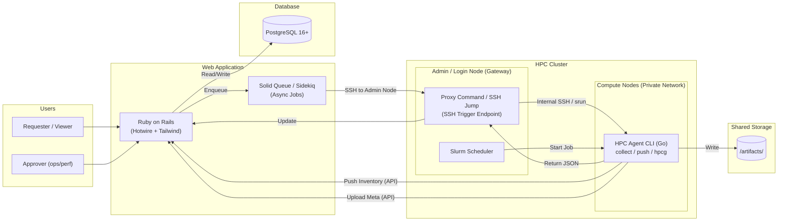

# **PRD v0.6.0 — HPC System Detection & Benchmark Tool**

Version: 0.6.0  
Status: Active Development  
Last Updated: 2026-01-09  
Changes: Standardized UI with NetBox theme, implemented v2 Host Hardware Info (Memory Topology), and added remote agent management.

## **1. 背景與目標 (Background & Objectives)**

在 HPC Linux 叢集中（x86_64 + aarch64），提供一套工具能達成以下目標：

* **全觀可視化**：以 Web UI 檢視各節點系統資訊（CPU/Memory/Storage/OS+Kernel/Network/IP…）。  
* **節點管理**：以 Web UI 管理節點清單（匯入 CSV）並手動觸發資訊更新。  
* **效能評測**：以 Web UI 檢視 Benchmark Recipes，並透過 CLI/Agent 原生編譯並執行 **HPCG**。  
* **數據追溯**：將評測結果 (Metrics) 與產出檔案 (Artifacts) 上傳至中央系統與共享儲存，確保可追溯性。

## **2. 使用者與角色 (User Roles)**

* **Requester (一般使用者)**：  
  * **V1**: 可檢視節點狀態、直接建立並執行 Benchmark Run Request (無須審核)。  
  * **V2**: 建立 Request 需經過 Approver 審核流程。  
* **Approver (Ops/Perf Team)** (**V2 新增**)：  
  * 可核准 Request（核准後才能提交 Slurm Job），管理節點清單。  
* **Viewer (唯讀)**：僅能檢視 Dashboard 與報告。

## **3. 環境與約束 (Environment & Constraints)**

* **HPC Environment**: Linux-based, Heterogeneous Architecture (x86_64 + aarch64).  
* **Network Topology**:  
  * **Web Server**: 位於管理網段 (Management Network) 或外部網路。  
  * **Compute Nodes**: 位於私有網段 (Private Network)，無法由 Web Server 直接連線。  
  * **Admin/Login Node**: 雙網卡 (Dual-homed)，作為 **Bastion Host (跳板機)** 或 **Gateway**，Web Server 需透過此節點管理 Compute Nodes。  
* **Storage**: Shared Storage (NFS/Lustre/GPFS) mounted on all nodes, **writable** by users/agent.  
* **Scheduler**: Slurm (V1 採用 Slurm Job 觸發 srun/sbatch).  
* **Modules**: Lmod / Environment Modules.

### **3.1 技術選型 (Tech Stack Decisions)**

* **Agent**: **Go (Golang) 1.22+**  
  * 使用 **Cobra** 構建 CLI。  
  * 優勢：編譯為 Static Binary，無須在各節點安裝 Runtime，部署極簡。  
* **Web Framework**: **Ruby on Rails 7.1+**  
  * 架構：Server-Side Rendering (Monolith)。  
  * Testing: **RSpec** (Unit, Request, System specs).
* **Frontend Interaction**: **Hotwire** (Turbo Drive, Turbo Frames, Turbo Streams) + Stimulus.js.  
  * 透過 HTML Over The Wire 達成類 SPA 體驗，同時保持開發單純性。  
* **Styling**: **Tailwind CSS**.
* **Database**: **PostgreSQL 16+**.
* **Design System**: NetBox-inspired (Data-dense, slate headers, bold uppercase titles, square corners).

## **4. 核心決策 (Core Decisions)**

* **執行模型**: **Hybrid (Push & Pull)**  
  * **Inventory (Pull via Gateway)**: Server 端 Collector 建立 SSH 連線至 **Admin Node**，再由 Admin Node 透過內部網路 (SSH/PDSH/Slurm) 觸發 Compute Node 的 `hpc-agent collect`。  
  * **Inventory (Push)**: Agent 可透過 cron 或啟動腳本執行 `hpc-agent inventory push` 主動回報 (適用於自動註冊/定期更新，需確保 Compute Node 可訪問 Web API)。  
  * **Benchmark (Push)**: Slurm Job 內的 Agent 主動執行並回報 DB，Artifacts 直寫 Shared Storage。  
* **Nodes 來源**: **Web UI 匯入 (CSV)** + 靜態清單 + Agent 主動註冊。  
* **Benchmark 環境**: **Native Compilation** (on-the-fly compile using modules/toolchain).
* **Auth**:  
  * **V1 (Standard)**:  
    * **Agent**: Cluster scoped API Token.  
    * **Web UI**: Local Web User Auth (Database-backed sessions).  
  * **V2 (Enterprise)**:  
    * **Web UI**: LDAP/AD Integration.
* **資料保留**: Node Current State + Historical Snapshots (Versioning).
* **規模**: < 50 Nodes, 20-200 Runs/day.

## **5. 功能需求 (Functional Requirements - V1)**

### **5.1 Inventory Management**

* **Node 匯入 (Web UI)**:  
  * 支援上傳 CSV 檔案。  
  * CSV 格式：hostname, ip (選填), role (compute/login), arch (選填)。  
  * 後端解析並更新 nodes 資料表。  
* **主動收集 (Agent Push)**:
  * Command: `hpc-agent inventory push`。
  * 行為：Agent 收集本機資訊 -> POST 到 API Server -> 更新 DB。
* **被動觸發 (Server Pull via Admin Node)**:
  * Action: Web UI 點擊 "Collect Now" (單一節點或批次)。
  * Backend Flow:
        1. Rails (Sidekiq) 建立 SSH 連線至 **Admin Node**。
        2. 在 Admin Node 上執行遠端指令 (e.g., `ssh <compute_node> hpc-agent collect --json` 或 `pdsh`)。
        3. 取得 JSON 輸出並解析更新 DB。  
* **配置版本控制 (Configuration Versioning)**:  
  * 系統需保留節點的歷史狀態 (History)。  
  * 每次收集 (Push/Pull) 若偵測到硬體或系統資訊變更（如 Kernel 更新、記憶體增減），應建立新的 node_state 版本記錄，而非僅覆蓋舊資料。  
* **硬體資訊 V2 (Enhanced Hardware Info)**:
  * **System & BIOS**: 包含 Manufacturer, Product Name, Serial Number, UUID, BIOS Version/Date.
  * **CPU Detail**: 包含 Architecture, Model, Sockets, NUMA Topology (Node ID to CPU mapping), 以及關鍵指令集 (AVX/AMX/SSE) 高亮顯示。
  * **Memory Topology**: 視覺化記憶體插槽佈局，依據 Socket 與 Channel 進行階層式分組，顯示 DIMM 狀態 (Active/Empty/Downgraded) 與詳細資訊 (Size, Speed, Serial)。
* **資料欄位**:  
  * System (DMI system info)
  * BIOS (DMI bios info)
  * Host (Hostname, Arch, OS, Kernel)  
  * CPU (Model, Cores, Threads, NUMA, Flags)  
  * Memory (Total, Free, Visual Topology Map)  
  * Storage (Disk usage, Mountpoints)  
  * Network (Interfaces, IP, MAC)

### **5.2 Agent Lifecycle Management (新增)**

* **遠端安裝 (Remote Install)**:
  * 透過 Web UI 填寫跳板機 (Bastion) 與目標節點資訊（Sudo 密碼）。
  * 自動化流程：連線 -> 上傳 Binary -> 設定服務 -> 啟動並向 API 註冊。
  * 支援選取不同的 API Key。
* **遠端卸載 (Remote Uninstall)**:
  * 一鍵移除節點上的 Agent 服務與相關檔案。
  * 狀態追蹤：即時顯示卸載進度。

### **5.3 Benchmarks Repository**

* UI 顯示 Released Recipes：  
  * **HPCG (High Performance Conjugate Gradients)**  
* 資訊包含：Version, Profiles (Module stack, Flags, Parameters), Supported Arch.

### **5.4 Benchmark Runs (Slurm-first)**

* 流程：使用者提交 Slurm Script -> Job 啟動 Agent -> Agent 執行評測。  
* Agent 職責 (Go Binary)：  
  1. **Environment Setup**: Load Modules, Check Fingerprint.  
  2. **Build**: Compile xhpcg (Native).  
  3. **Config**: 自動生成 hpcg.dat。  
  4. **Run**: 執行 srun ./xhpcg。  
  5. **Parse**: 解析 Log 取得 GFLOPS, Time, Residual, Pass/Fail。  
  6. **Upload**: 更新 DB 狀態 (API)，上傳 Artifact Index。

### **5.5 Artifacts Management**

* **儲存位置**：預設位於專案資料夾下的 /artifacts/<cluster_id>/<run_id>/，可透過 config.yaml 設定覆寫路徑（通常指向 Shared Storage）。  
* **寫入機制**：原子性寫入 (Atomic Write)。先寫入 <run_id>.tmp/，完成後 Rename 為 <run_id>/。  
* **必要檔案**：MANIFEST.json, run-meta.json, Logs, Raw Results.

### **5.6 Web UI Features (Rails + Hotwire)**

整合 NetBox 設計規範，採用單體式架構 (Monolith) 實作。

#### **5.6.1 全域導航與佈局 (Global Layout)**

* **Sidebar Navigation**:  
  * **位置**: 固定左側 (Fixed Left, 240px~280px)。  
  * **風格**: NetBox Slate (深色背景, 品牌綠色強調)。  
  * **選單項目**:  
    * Dashboard, Nodes, Benchmark Runs, Recipes, API Keys, Settings.
* **UI Components**:
  * **card-netbox**: 標準化卡片元件，包含 slate 背景標題列 (card-header) 與粗體大寫標題。
  * **Modals**: 統一使用 `shared/_modal` 模板，支援 Turbo Frame 非同步載入。

#### **5.6.2 總覽儀表板 (Overview Dashboard)**

* **關鍵指標 (Hero Metrics Cards)**:  
  * 採用 `card-netbox` 樣式，依據指標類型提供顏色強調 (Emerald/Violet/Blue/Amber)。
* **節點熱圖 (Visual Node Grid)**:  
  * **呈現**: 小方塊網格，支援狀態顏色標示。  
  * **互動**: 點擊節點開啟「過濾模式」，下方列表即時更新。  
  * **Tooltip**: 高 z-index 懸浮提示，顯示節點詳細狀態。
* **近期活動 (Filtered Runs List)**:  
  * 列出最新執行的評測，包含狀態圖示、Recipe 名稱、節點名稱與耗時。

#### **5.6.3 詳細檢測面板 (Run Detail Inspector)**

* **元件**: **Slide-over Panel**。  
* **內容結構**:  
  * **Tabs**: Summary (基本資訊), Metrics (詳細數值), Logs (執行日誌), Artifacts (產出檔案清單)。

#### **5.6.4 Nodes & Runs Pages**

* **Nodes Page**:  
  * 提供節點清單管理，支援單一或批次資訊收集。
* **Node Detail View**:  
  * **功能**: 分頁檢視節點資訊 (Overview, Hardware, History, Logs)。
  * **Hardware Tab**: 展示 V2 硬體資訊，包含 System/BIOS 表格與互動式 **Memory Topology Map**。
  * **History**: 支援切換不同時間點的硬體快照。

### **5.7 Agent V1 Scope (Go)**

V1 Agent 功能定義：

1. **Collect**:  
   * `hpc-agent collect`: 輸出系統資訊 (CPU/Mem/Disk/Net) JSON 到 stdout。
   * `hpc-agent inventory push`: 收集資訊並主動 POST 至 API。
2. **HPCG Run (Single-node)**: 完整 Build/Run/Parse 流程。

* **Non-Goals**: Build Cache, Multi-node orchestration (Rank0 leader), HPL support.  
* **Deploy**: 單一靜態編譯執行檔 (Single Static Binary)。

## **6. 資料模型 (Data Schema - V1)**

* nodes: id, hostname, ip, role, arch, source (csv/manual/agent_push).  
* node_states: **(Versioned Data)**  
  * id: PK  
  * node_id: FK  
  * cpu_json, mem_json, disk_json, net_json, host_json, dmi_json: 系統資訊快照。  
  * captured_at: 此版本建立時間 (Timestamp)。  
  * 說明：One Node has_many NodeStates。最新的一筆即為 Current State。  
* benchmark_recipes: id, name (hpcg), version, default_profile_json.  
* benchmark_runs: id, node_id, recipe_id, start_time, end_time, status, metrics_json (gflops).  
* artifact_indices: run_id, path, file_type, size.

## **7. 非功能需求 (Non-Functional Requirements)**

* **Performance**: `hpc-agent collect` < 1s.  
* **Reliability**: API Idempotency.  
* **Security**: HTTPS only, Token-based Agent Auth.  
* **UX**: 符合 NetBox 設計規範 (Data-dense)，支援 Dark/Light Mode 自動切換 (Tailwind dark: variant)。  
* **Color System**: 使用 Tailwind 語意化命名 (bg-app, bg-surface, status-success 等) 以支援主題切換。

## **8. 系統架構圖 (System Architecture)**

